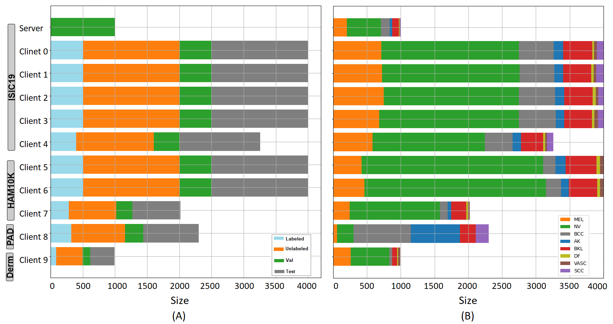
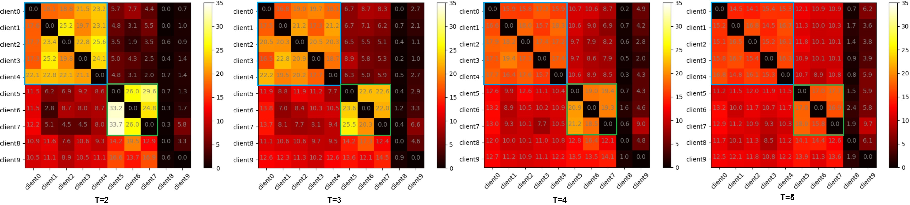
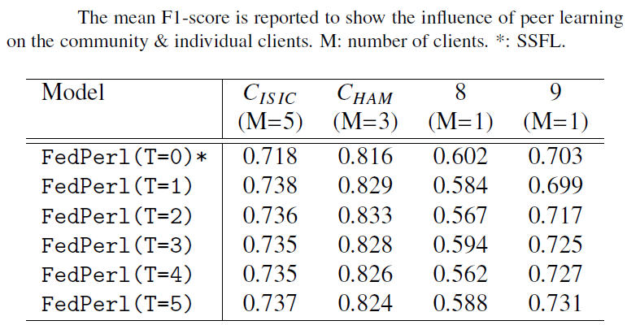

# [FedPerl: Semi-Supervised Federated Peer Learning for Skin Lesion Classification](https://arxiv.org/pdf/2103.03703.pdf)
### [Tariq Bdair](http://campar.in.tum.de/Main/TariqBdair), [Nassir Navab](http://campar.in.tum.de/Main/NassirNavab), [Shadi Albarqouni](https://albarqouni.github.io/)
Globally, Skin carcinoma is among the most lethal diseases. Yearly, millions of people are diagnosed with skin cancer. Fortunately, detecting this cancer in the early stages decreases the medication cost and mortality rate substantially. The recent improvement in automated cancer classification using deep learning methods has reached a human-level performance. While this achievement requires a large amount of annotated data assembled in one location, finding such conditions usually is not feasible. Recently, federated learning has acquired a lot of interest. The main idea of federated learning is to train decentralized machine learning models in a privacy-preserved fashion, making federated learning fit the medical setting. Still, federated learning depends on labeled data at the client-side, which is most of the time not available and costly. To address this, we propose FedPerl, a semi-supervised federated learning method. Our method is inspired by peer learning from educational psychology and ensemble averaging from committee machines. FedPerl builds communities based on clients’ similarities. Then encourages its members to learn from each other to generate more accurate pseudo labels for the unlabeled data. We also proposed the peer anonymization (PA) technique to hide the clients’ identities and preserve privacy. As a core component of our method, PA reduces the communication cost while enhances performance. We validate our method on 71,000 skin lesion images collected from 5 publicly available datasets. With few annotated data, FedPerl outperforms state-of-the-art SSFL and the baselines by 1.8% and 15.8%, respectively. Also, it generalizes better to an unseen client while less sensitive to noisy ones.
# FedPerl: Method
Our proposed FedPerl, illustrated below, consists of three components; namely 1) Building communities: similar clients clustered into one community, 2) Peer Learning: peers are helping in pseudo labeling and 3) Peer Anonymization (PA) hides client identity, preserves privacy, and reduces the communication cost.
 
# FedPerl: Datasets and clients 
Our database consists of 71,000 images collected from 5 publicly available datasets. The previous datasets are divided randomly into ten clients besides the global model, without overlap between datasets. Then, each client data divided into testing (gray), validation (green), labeled (blue), and unlabeled (orange) data. The data split intended to resemble a realistic scenario with varying data size, severe class imbalance, and diverse communities. (A) & (B) Show the clients and classes distribution from our datasets.

# FedPerl: Skin lesion results 
FedPerl outperforms the lower model with RI between 14:53% and 15:46%. Further, FedPerl exceeds (SSFL) FedAvg by 1:8% and the local upper bound by 2:9%. After applying the peer anonymization, all models show a similar or slightly better performance when compared to the previous results without PA (denoted  w/o PA), while still better in preserving privacy and reducing the communication cost O(1) regardless of the committee size T.

# FedPerl: Building communities
The percentage of selecting peers during the training at diferent T values is shown below. The blue & green rectangles show that the clients clustered into two main communities. On average 86:24% of the time, first community members learn from each other (blue rectangle) , while it is 57:77% for community 2 (green rectangle).


# FedPerl: Clients results
The performance improvement is observed for all clients except client 8 due to the class distribution mismatch. Yet, after removing client 8 from the training, FedPerl still outperforms the local upper and the (SSFL) FedAvg models. Note that client 8 has negative impact, such negative behavior could represent a threat in the federated learning, where a noisy and out-of-distribution client might hurt other clients and mislead the global model. FedPerl is less prone to the negative and noisy impact than SSFL, thanks to the training schema we proposed.

# FedPerl: Class level results
FedPerl enhances the accuracy for BCC, BKL, DF, VASC, and SCC lesions by 16:6%, 21:8%, 50:4%, 42:0%, and 18:0%, respectively, in the SSL setting. The improvement reaches ten times in the DF class. 

# FedPerl: Qualitative results
Sample predictions of FedPerl and SSFL for skin lesion. FedPerl confidence is shown below the images in the first raw, while the second raw shows the confidence for FedPerl and SSFL respectively. 
 
If you found our code useful, please cite:
```
@article{bdair2021peer,
  title={Peer Learning for Skin Lesion Classification},
  author={Bdair, Tariq and Navab, Nassir and Albarqouni, Shadi},
  journal={arXiv preprint arXiv:2103.03703},
  year={2021}
}
```

## License

<a rel="license" href="https://creativecommons.org/licenses/by-nc/2.0/"></a>

