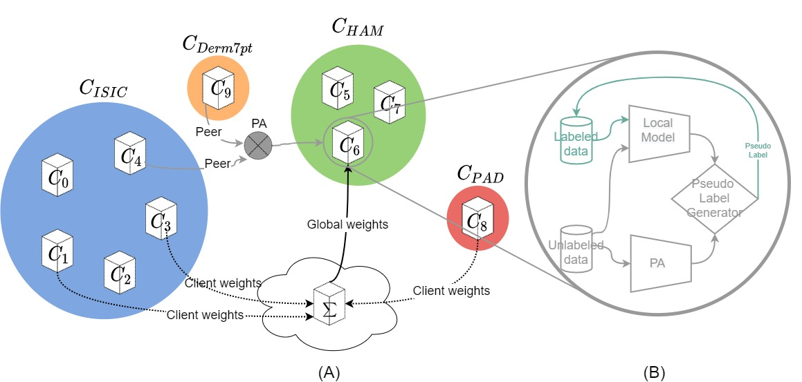
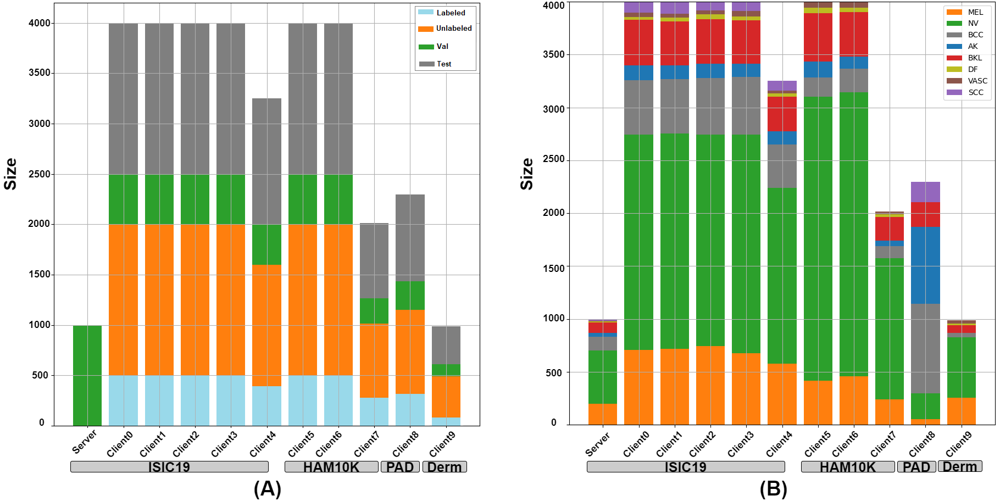
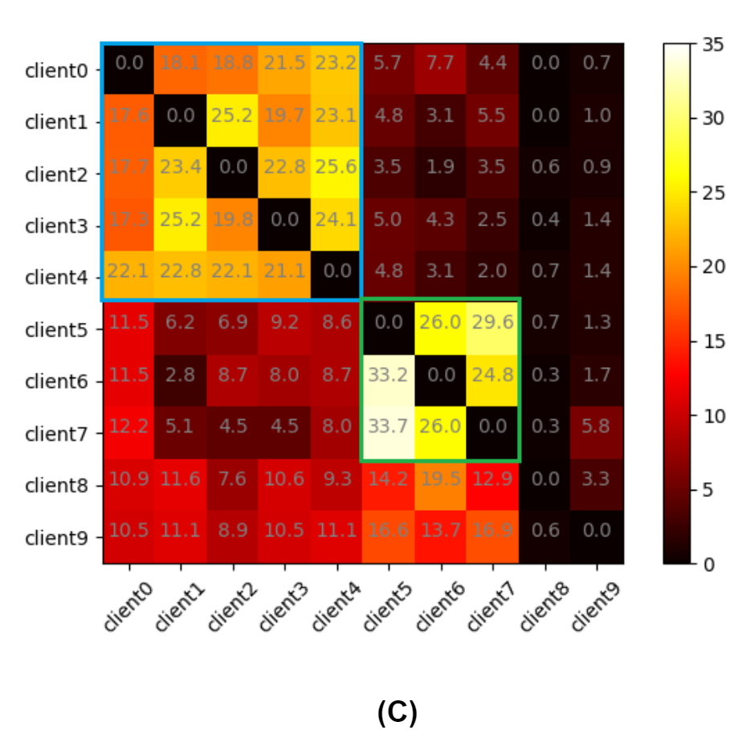
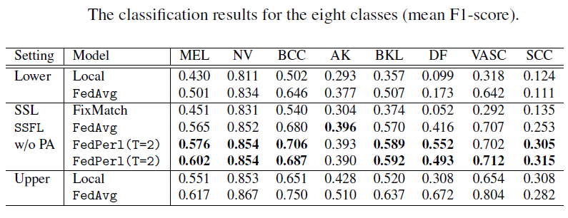

# [FedPerl: Semi-Supervised Peer Learning for Skin Lesion Classification](https://arxiv.org/pdf/2103.03703.pdf)
### [Tariq Bdair](http://campar.in.tum.de/Main/TariqBdair), [Nassir Navab](http://campar.in.tum.de/Main/NassirNavab), [Shadi Albarqouni](https://albarqouni.github.io/)
Pytorch implementation for MICCAI 2021 paper "FedPerl: Semi-Supervised Peer Learning for Skin Lesion Classification"
# FedPerl: Abstract
Skin cancer is one of the most deadly cancers worldwide. Yet, it can be reduced by early detection. Recent deep-learning methods have shown a dermatologist-level performance in skin cancer classification. Yet, this success demands a large amount of centralized data, which is oftentimes not available. Federated learning has been recently introduced to train machine learning models in a privacy-preserved distributed fashion demanding annotated data at the clients, which is usually expensive and not available, especially in the medical field. To this end, we propose FedPerl, a semi-supervised federated learning method that utilizes peer learning from social sciences and ensemble averaging from committee machines to build communities and encourage its members to learn from each other such that they produce more accurate pseudo labels. We also propose the peer anonymization (PA) technique as a core component of FedPerl. PA preserves privacy and reduces the communication cost while maintaining the performance without additional complexity. We validated our method on 38,000 skin lesion images collected from 4 publicly available datasets. FedPerl achieves superior performance over the baselines and state-of-the-art SSFL by 15.8%, and 1.8% respectively. Further, FedPerl shows less sensitivity to noisy clients.
# FedPerl: Method
Our proposed FedPerl, illustrated below, consists of three components; namely 1) Building communities: similar clients clustered into one community, 2) Peer Learning: peers are helping in pseudo labeling and 3) Peer Anonymization (PA) hides client identity, preserves privacy, and reduces the communication cost.
 
# FedPerl: Datasets and clients 
Our database consists of 38,000 images collected from 4 publicly available datasets. The previous datasets are divided randomly into ten clients besides the global model, without overlap between datasets. Then, each client data divided into testing (gray), validation (green), labeled (blue), and unlabeled (orange) data. The data split intended to resemble a realistic scenario with varying data size, severe class imbalance, and diverse communities. (A) & (B) Show the clients and classes distribution from our datasets.

# FedPerl: Skin lesion results 
FedPerl outperforms the lower model with RI between 14:53% and 15:46%. Further, FedPerl exceeds (SSFL) FedAvg by 1:8% and the local upper bound by 2:9%. After applying the peer anonymization, all models show a similar or slightly better performance when compared to the previous results without PA (denoted  w/o PA), while still better in preserving privacy and reducing the communication cost O(1) regardless of the committee size T.

# FedPerl: Building communities
The percentage of selecting peers during the training at diferent T values is shown below. The blue & green rectangles show that the clients clustered into two main communities. On average 86:24% of the time, first community members learn from each other (blue rectangle) , while it is 57:77% for community 2 (green rectangle).

# FedPerl: Clients results
The performance improvement is observed for all clients except client 8 due to the class distribution mismatch. Yet, after removing client 8 from the training, FedPerl still outperforms the local upper and the (SSFL) FedAvg models. Note that client 8 has negative impact, such negative behavior could represent a threat in the federated learning, where a noisy and out-of-distribution client might hurt other clients and mislead the global model. FedPerl is less prone to the negative and noisy impact than SSFL, thanks to the training schema we proposed.

# FedPerl: Class level results
FedPerl enhances the accuracy for BCC, BKL, DF, VASC, and SCC lesions by 16:6%, 21:8%, 50:4%, 42:0%, and 18:0%, respectively, in the SSL setting. The improvement reaches ten times in the DF class. 



If you found our code useful, please cite:
```
@inproceedings{bdair2021fedperl,
  title={FedPerl: Semi-supervised Peer Learning for Skin Lesion Classification},
  author={Bdair, Tariq and Navab, Nassir and Albarqouni, Shadi},
  booktitle={International Conference on Medical Image Computing and Computer-Assisted Intervention},
  pages={336--346},
  year={2021},
  organization={Springer}
}
```

## License

<a rel="license" href="https://creativecommons.org/licenses/by-nc/2.0/"></a>

